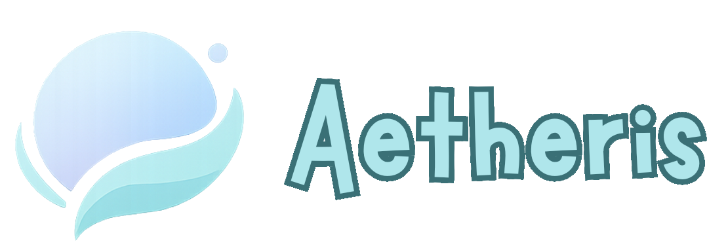

# 🌌 Aetheris

> **Plataforma de aprendizaje tecnológico personalizada**  
> Conectando conocimiento, comunidad y crecimiento profesional en el mundo tech.



---

## 📖 Sobre el Proyecto

**Aetheris** es una plataforma educativa diseñada para ofrecer **rutas de aprendizaje personalizadas** en áreas tecnológicas como DevSecOps, Python, Cybersecurity, Inteligencia Artificial y Análisis de Datos.

El nombre *Aetheris* proviene del concepto del **éter**: aquello invisible que conecta todo, que sostiene la luz y la energía en movimiento. Esa misma esencia inspira nuestra misión: conectar datos, inteligencia y seguridad de forma fluida, confiable y futurista.

### 🎯 Objetivo

Democratizar el acceso a la educación tecnológica mediante:
- ✅ Rutas de aprendizaje adaptativas basadas en intereses del usuario
- ✅ Múltiples estilos de estudio (videos, labs, libros, clases en vivo)
- ✅ Comunidad integrada para colaboración y networking
- ✅ Sistema de certificación y seguimiento de progreso
- ✅ Contenido curado por expertos de la industria

---

## 🚀 Características Principales

### 🔐 Autenticación Inteligente
- Registro en 3 pasos con personalización de perfil
- Validación de contraseña con medidor de fortaleza en tiempo real
- Integración con proveedores OAuth (Google, Facebook, Microsoft, GitHub)

### 📚 Catálogo de Cursos
- Exploración por categorías técnicas
- Filtrado por nivel de dificultad
- Sistema de recomendaciones basado en intereses

### 👥 Comunidad
- Foro de discusión integrado
- Sistema de posts y comentarios
- Networking entre estudiantes

### 📊 Perfil de Usuario
- Dashboard personalizado con progreso
- Certificados descargables
- Historial de aprendizaje

---

## 🛠️ Stack Tecnológico

### Frontend
- **React 19.1** - Librería UI con componentes funcionales
- **Vite 7.1** - Build tool ultrarrápido con HMR
- **React Router 7.9** - Navegación SPA
- **Tailwind CSS 4.1** - Framework CSS utility-first
- **Axios 1.12** - Cliente HTTP para API REST

### Herramientas de Desarrollo
- **ESLint** - Linter para código consistente
- **Babel React Compiler** - Optimización automática
- **PostCSS** - Transformación de CSS

---

## 📁 Estructura del Proyecto

```
aetheris/
├── public/                  # Archivos estáticos
├── src/
│   ├── assets/             # Imágenes, fuentes, recursos
│   │   ├── fonts/         # Marykate, Nunito
│   │   └── imgs/          # Logo, ilustraciones
│   ├── components/        # Componentes reutilizables
│   │   └── Navbar.jsx     # Barra de navegación
│   ├── pages/             # Páginas/vistas principales
│   │   ├── Landing.jsx    # Página de inicio
│   │   ├── Login.jsx      # Inicio de sesión
│   │   ├── Register.jsx   # Registro multi-paso
│   │   ├── Cursos.jsx     # Catálogo de cursos
│   │   ├── Comunidad.jsx  # Foro comunitario
│   │   └── Perfil.jsx     # Dashboard de usuario
│   ├── App.jsx            # Componente raíz con routing
│   ├── main.jsx           # Entry point
│   └── index.css          # Estilos globales + Tailwind
├── index.html             # HTML base
├── vite.config.js         # Configuración de Vite
├── postcss.config.js      # Configuración de PostCSS
├── eslint.config.js       # Configuración de ESLint
└── package.json           # Dependencias y scripts
```

---

## 🎨 Sistema de Diseño

### Paleta de Colores
```css
--color-background: #c1dbfa  /* Azul cielo suave */
--color-text: #1e293b        /* Gris oscuro legible */
--color-white: #ffffff       /* Blanco puro */
```

### Tipografía
- **Display**: Marykate (títulos y branding)
- **Sans**: Nunito (cuerpo de texto)

### Principios de Diseño
- ✨ **Responsive-first**: Mobile y desktop optimizado
- 🎯 **Accesibilidad**: Contraste WCAG AA+
- ⚡ **Performance**: Lazy loading y code splitting
- 🌊 **Fluidez**: Transiciones suaves y feedback visual

---

## 🔄 Flujo de Usuario

### 1️⃣ Registro
```
Inicio → Email/Contraseña → Intereses → Estilo de Estudio → Dashboard
```
- **Paso 1**: Credenciales con validación de fortaleza de contraseña
- **Paso 2**: Selección de áreas de interés (multi-select)
- **Paso 3**: Preferencias de aprendizaje (videos, labs, libros, etc.)

### 2️⃣ Navegación Principal
```
Landing → Login/Register → Cursos → Comunidad → Perfil
```

### 3️⃣ Aprendizaje
```
Explorar Cursos → Seleccionar Ruta → Módulos → Certificación
```

---

## 📄 Licencia

Este proyecto está bajo la Licencia MIT. Ver archivo `LICENSE` para más detalles.

---

## 🙏 Agradecimientos

- Fuentes tipográficas: Marykate y Nunito
- Iconos: Heroicons y custom SVG
- Inspiración: Comunidad open-source de React

---

<div align="center">
  <p>Hecho con 💙 por el equipo de Aetheris</p>
  <p>© 2025 Aetheris - Conectando conocimiento, comunidad y crecimiento</p>
</div>
